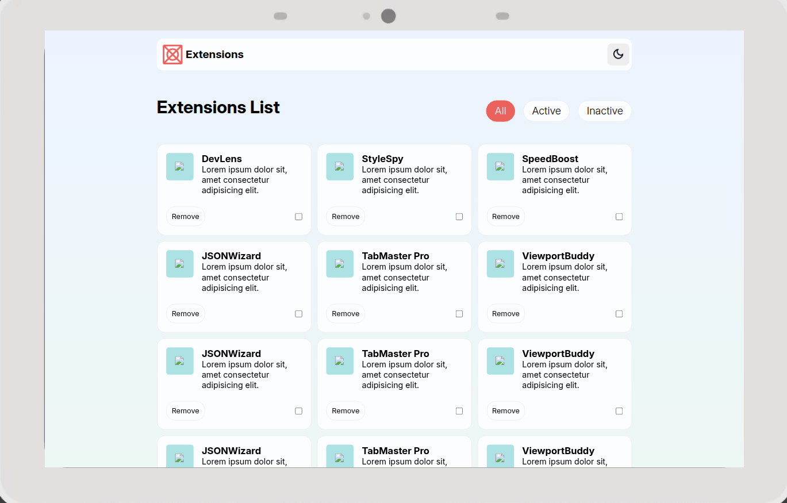
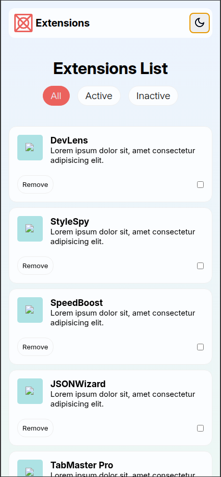

# 🔧 Browser Extension Manager UI

This project is a **user interface for managing browser extensions** in a sleek and intuitive way.  
Built with just HTML and CSS, the UI simulates the control panel of a browser extension manager, offering a clean layout for organizing and displaying extensions.

🌐 **Live Demo:** [jonas-petty.github.io/Browser_extension_manager_UI](https://jonas-petty.github.io/Browser_extension_manager_UI/)

---

## 📸 Preview

| Desktop                               | Mobile                               |
| ------------------------------------- | ------------------------------------ |
|  |  |

---

## ✨ Features

-   Beautiful and responsive UI
-   Simulated extension management interface
-   Fast and lightweight frontend

## 🛠️ Technologies Used

-   **HTML5**
-   **CSS3**

## 📬 Contact

Feel free to connect:

-   🌐 Portfolio: [jonasfelix.dev](https://jonasfelix.dev)
-   💼 LinkedIn: [linkedin.com/in/jonasfelix](https://www.linkedin.com/in/jonasfelix)
-   📧 Email: \[[jonasfelixdesouza21@gmail.com](mailto:jonasfelixdesouza21@gmail.com)]

## 🙌 Acknowledgments

Based on the Frontend Mentor challenge design.
